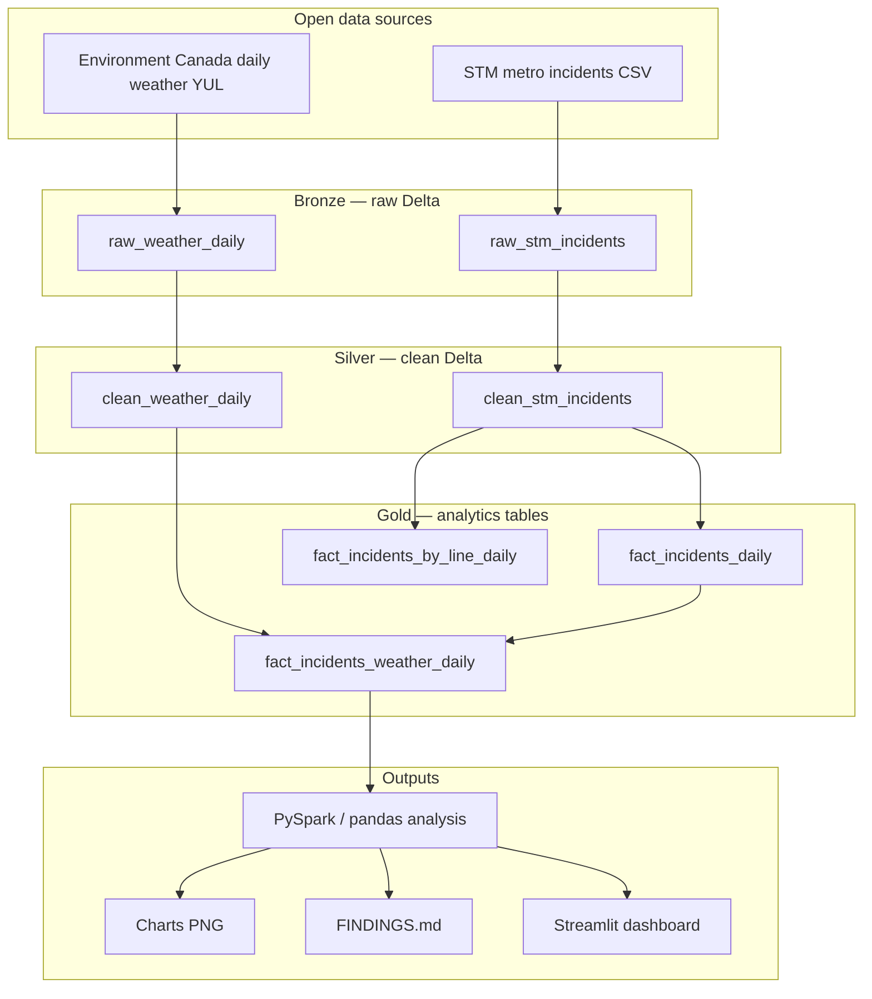
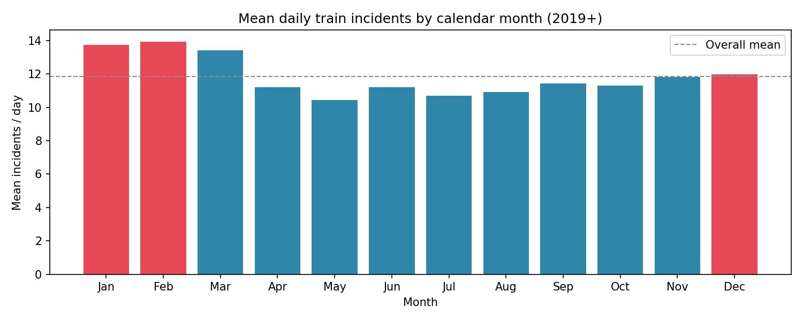
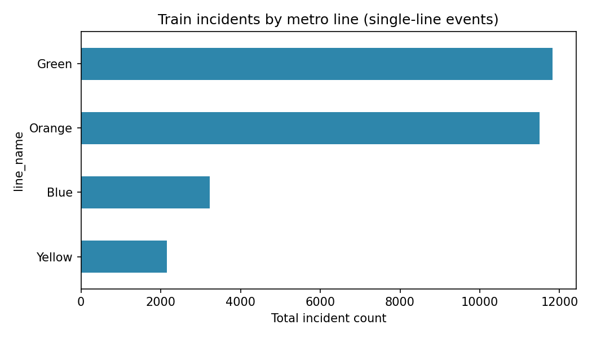
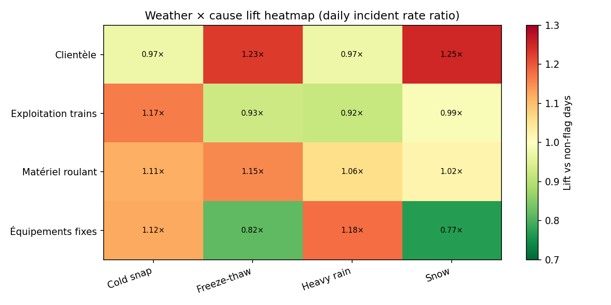
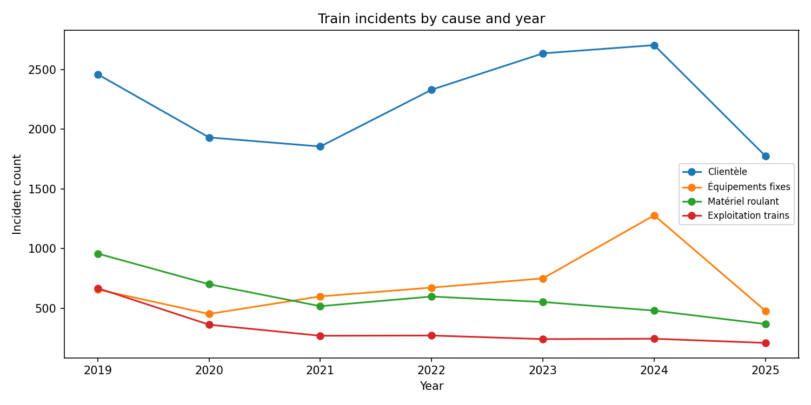
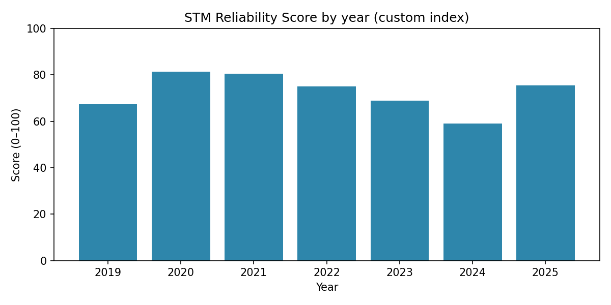
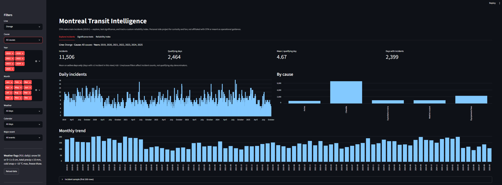

# Montreal Transit Analysis

**STM metro disruption analytics from open data + weather**

**Repository:** [github.com/3MinCurry/montreal-transit-intelligence](https://github.com/3MinCurry/montreal-transit-intelligence)

*A personal side project — built out of curiosity and for fun. Not affiliated with STM, not operational advice, and not an official product.*

Analyzed **29,167** STM metro train incidents from **2019–2025** alongside weather, holiday, event, and rider-experience datasets.

## Project scope

This project focuses exclusively on **STM metro train incidents** (`Type = T`) from the **Green, Orange, Blue, and Yellow** lines. Bus operations, REM, Exo, and station-only incidents are intentionally excluded.

---

## Problem

Montreal STM riders experience metro delays, but it is hard to see **patterns** in when and why disruptions happen. STM publishes open incident data and Environment Canada publishes daily weather — but they live in separate silos.

**Research question:** What factors are associated with **STM metro reliability** — **weather**, **calendar context**, **incident cause**, and **operations** patterns (2019+ train disruptions)?

This project joins those sources into a reproducible analytics pipeline and documents findings with honest **association, not causation** language.

---

## Architecture



**Runs on:** local Python (pandas) and **Databricks Free Edition** (PySpark + Unity Catalog Volumes + Delta).

## Why Databricks?

The project was intentionally implemented using a **lakehouse** architecture with **Delta Lake** tables and **Bronze → Silver → Gold** layers — not because the dataset requires a cluster, but to demonstrate a reproducible data-engineering workflow:

- **Bronze** — raw STM and weather CSVs landed unchanged  
- **Silver** — cleaned types, parsed timestamps, weather flags  
- **Gold** — daily fact tables for incidents, lines, and weather joins  
- **Analytics** — shared `src/mti/` logic runs on gold outputs locally (pandas) or on Databricks (PySpark + pandas)

Same findings either path; Databricks shows the ELT story for a portfolio. Setup: [`docs/DATABRICKS_SETUP.md`](docs/DATABRICKS_SETUP.md).

## Engineering takeaways

- Built Delta Lake Bronze/Silver/Gold pipelines on Databricks  
- Implemented data quality validation gates  
- Designed reproducible analytics workflows across local pandas and PySpark  
- Applied bootstrap confidence intervals and permutation testing  

---

## Key findings

| Finding | Result |
|---------|--------|
| Winter vs summer daily rate | **~1.21×** |
| Weekday vs weekend daily rate | **~1.31×** |
| Weekday AM rush (7–9 AM) share | **~20%** of incidents |
| Snow / freeze-thaw weather lift | **~1.05–1.10×** (modest) |
| Top cause | **Clientèle ~54%**; share **rose 2019 → 2024** |
| COVID era | Daily mean fell **~14 → ~10** (2020–21), recovered by 2024 |
| Green line | **~41%** of single-line train incidents |

**Stronger insights (cause-level):**
- Snow days raise **Clientèle** incidents (**~1.25×**); **Équipements fixes** actually **drops (~0.77×**)
- **Clientèle** share rose **52% → 57%** (2019–2024); **Matériel roulant** fell **20% → 10%**
- Snow **D+2** lift (**~1.17×**) exceeds same-day snow — disruptions may peak days after a storm

Full report: [`FINDINGS.md`](FINDINGS.md)

---

## Sample charts

### Seasonal pattern


### Incidents by line


### Weather × cause (heatmap)


### Cause counts over time


### Reliability score by year


---

## Technologies

| Layer | Stack |
|-------|--------|
| Language | Python 3.10+ |
| Local ELT | pandas |
| Cloud ELT | PySpark, Delta Lake |
| Orchestration | Databricks notebooks, `scripts/run_pipeline.py` |
| Storage | Unity Catalog Volumes (`/Volumes/workspace/default/mti/`) |
| Viz | matplotlib, Streamlit |
| Quality | pytest, data quality gates |

---

## Data sources

| Source | Coverage | Link |
|--------|----------|------|
| STM metro incidents | 2019+ train (`T`) events | [donnees.montreal.ca](https://donnees.montreal.ca/en/dataset/incidents-du-reseau-du-metro) |
| Weather YUL (station 51157) | Daily temps, precip, snow | [GeoMet API](https://api.weather.gc.ca/collections/climate-daily/items?STN_ID=51157) |
| Quebec holidays & major events | Curated Montreal calendar windows | `src/mti/calendar_enrichment.py` |
| Canadiens home games | NHL schedule (Bell Centre proxy) | `scripts/download_canadiens_schedule.py` |
| Montreal 311 | Daily Requête + Plainte counts | `scripts/download_311.py` |
| STM published experience | Yearly customer-experience % (reference) | `data/reference/stm_experience_yearly.csv` |

---

## Quick start

```powershell
pip install -e ".[dev]"
.\scripts\download_data.ps1
python scripts/run_pipeline.py   # FINDINGS.md + charts
python -m streamlit run scripts/run_dashboard.py   # interactive explorer (pip install -e ".[dashboard]")
pytest
```

**Databricks:** [`docs/DATABRICKS_SETUP.md`](docs/DATABRICKS_SETUP.md)

## Dashboard

Interactive exploration — filter by line, cause, year, month, weather, and calendar; browse significance tests and a custom reliability index:



```powershell
pip install -e ".[dashboard]"
python -m streamlit run scripts/run_dashboard.py
```

---

## Repo layout

```
src/mti/           # pipeline library (cleaning, spark, analysis, charts)
notebooks/         # Databricks runners
scripts/           # download, run_pipeline, run_dashboard
docs/images/       # README chart snapshots + dashboard screenshot
FINDINGS.md        # full analysis report
```

---

## Custom metrics

**STM Reliability Score (custom):** 0–100 index from daily incident count and disruption minutes vs network medians. Documented in `FINDINGS.md` — not an official STM KPI.

**City Activity Index:** composite of weekends, Quebec holidays, and major Montreal event days (Jazz Fest, F1, Osheaga, etc.).

**Forecast:** 28-day rolling mean baseline for next-week incident rate (exploratory only).

---

## License & attribution

MIT — see [`LICENSE`](LICENSE).

STM data: **Société de transport de Montréal** (CC BY 4.0). Weather: **Environment and Climate Change Canada**.
